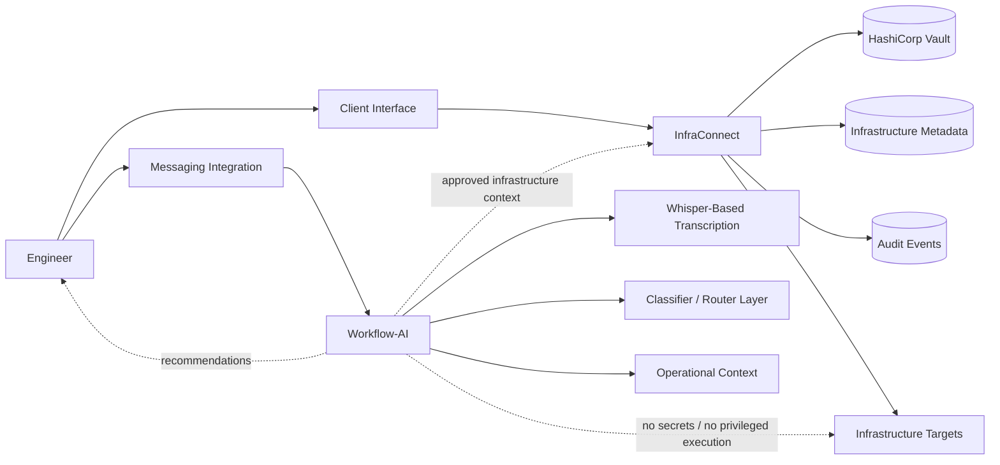

# OpsControl

**Security-first infrastructure access platform with AI-assisted operational context.**

OpsControl is a private, self-hosted infrastructure access platform focused on controlled access workflows, Vault-backed credential handling, service visibility, operational traceability, and AI-assisted infrastructure context.

It is designed for engineering teams that need stronger operational control over infrastructure access without giving an AI layer privileged execution rights.

OpsControl is not open source. Source code is developed privately.

## Core Principles

- **Security-first access workflows**: access paths should be explicit, controlled, and reviewable.
- **Human-in-the-loop operations**: engineers approve and perform operational actions.
- **AI-assisted analysis, not AI-controlled infrastructure**: AI helps interpret context; it does not operate infrastructure.
- **Self-hosted by design**: the platform is intended for private infrastructure environments.
- **Operational traceability**: access and credential workflows should leave useful operational evidence.

## What OpsControl Does

OpsControl brings together two product layers:

- centralizes infrastructure access metadata;
- integrates with Vault for secret handling;
- provides service and port visibility;
- supports controlled SSH and infrastructure access workflows;
- keeps operational actions engineer-controlled;
- provides AI assistance for logs, documentation, voice/text queries, and operational context.

## Example Use Cases

- Infrastructure access visibility across registered systems and services.
- Controlled SSH workflow support with credential boundaries.
- Operational troubleshooting assistance from service context and engineer-provided logs.
- Service availability context for incident triage.
- Documentation-grounded incident analysis.
- AI-assisted operational triage without handing over infrastructure control.

## What OpsControl Does Not Do

- AI does not execute privileged infrastructure actions.
- AI does not receive secrets or Vault credentials.
- AI does not replace engineer approval.
- AI does not perform automatic privileged changes.
- AI does not act as an infrastructure control plane.

## Product Modules

### InfraConnect

InfraConnect is the controlled access and visibility layer.

It focuses on:

- infrastructure access metadata;
- Vault-backed credential handling;
- service and port visibility;
- controlled access workflows;
- access event tracking.

### Workflow-AI

Workflow-AI is the assistance layer.

It focuses on:

- voice and text intake;
- transcription-assisted workflows;
- query classification and routing;
- log and document analysis;
- contextual recommendations for engineers.

Workflow-AI is intentionally separated from privileged infrastructure access.

## High-Level Architecture

## Current Status

OpsControl is an early-stage product under active private development. The public repository contains product overview and technical documentation only. Source code is developed privately.

The product direction is centered on controlled infrastructure access, Vault-backed credential workflows, service visibility, traceable operations, and AI-assisted context with a strict boundary between assistance and privileged access.

## Technology Stack

High-level technologies used across the platform:

- FastAPI
- PostgreSQL
- HashiCorp Vault
- Redis
- Docker
- messaging integration, including Telegram
- Whisper-based transcription
- classifier/router layer
- optional workflow orchestration

## Roadmap Summary

| Area | Status |
| --- | --- |
| Vault-backed access metadata | Available |
| Service and port visibility | Available |
| Traceable access workflows | Available |
| AI-assisted query routing and transcription | Available |
| Unified infrastructure context flow | In progress |
| Access workflow hardening | In progress |
| Documentation-grounded assistance | In progress |
| Temporary credential patterns | Planned |
| Web dashboard | Planned |
| Proactive alerting with engineer review | Planned |
| Deeper knowledge base / RAG | Planned |

See [Roadmap](docs/roadmap.md) for more detail.

## Documentation

- [Architecture](docs/architecture.md)
- [Security Model](docs/security-model.md)
- [Roadmap](docs/roadmap.md)
- [Demo Scenarios](docs/demo-scenario.md)

## Contact

- Website: https://opscontrol.dev
- Email: hello@opscontrol.dev
