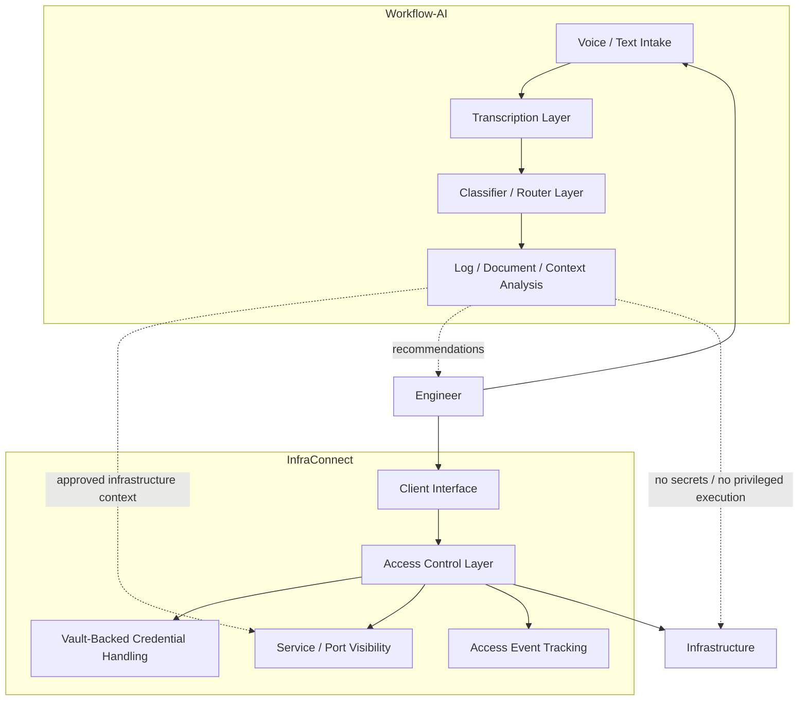
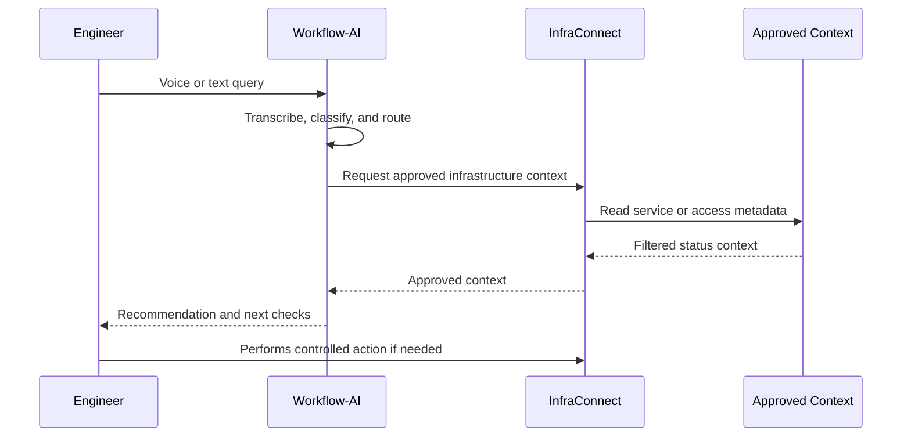

# Architecture

OpsControl is organized around two separated layers:

- **InfraConnect**: controlled access, credential handling, service visibility, and traceable workflows.
- **Workflow-AI**: operational assistance for voice/text queries, logs, documentation, and context analysis.

The architecture keeps a strict boundary between AI-assisted context and privileged infrastructure access.

## High-Level Components

## InfraConnect Role

InfraConnect is the infrastructure access layer.

It is responsible for:

- maintaining infrastructure access metadata;
- integrating with Vault-backed credential handling;
- exposing service and port visibility;
- supporting controlled access workflows;
- producing access event records.

InfraConnect is the boundary where credential-sensitive operations belong. It is not replaced by the AI layer.

## Workflow-AI Role

Workflow-AI is the operational assistance layer.

It is responsible for:

- accepting engineer voice or text queries;
- transcribing operational requests when needed;
- classifying and routing requests by intent and complexity;
- helping analyze logs, notes, documents, and operational context;
- returning recommendations or next checks to the engineer.

Workflow-AI does not hold secrets and does not execute privileged actions.

## Query-To-Context Flow

## Approved Context

Workflow-AI may use approved context such as:

- service availability status;
- port visibility;
- infrastructure metadata needed for troubleshooting;
- documentation and runbook context;
- logs or notes provided by an engineer.

These signals are used to improve operational recommendations without exposing credentials or granting execution rights.

## Restricted Data And Actions

Secrets and privileged actions remain within controlled access boundaries.

Workflow-AI should not receive restricted credential material or execute changes against infrastructure.

## Design Intent

OpsControl is designed to make infrastructure context easier to access while preserving the operational boundary:

- AI provides context and recommendations.
- Engineers approve and perform actions.
- Credential workflows remain controlled by InfraConnect.
- Secrets remain outside the AI layer.
